# Fotos del examen

Aquí están las fotos del examen:

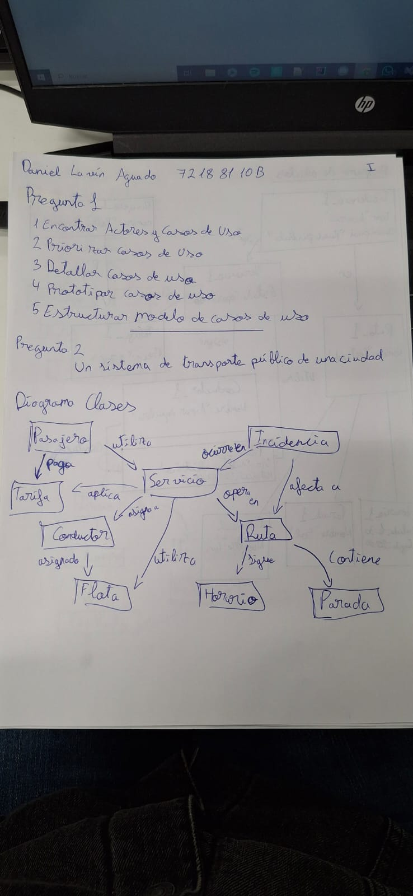
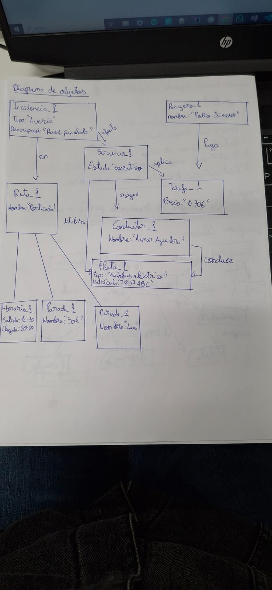
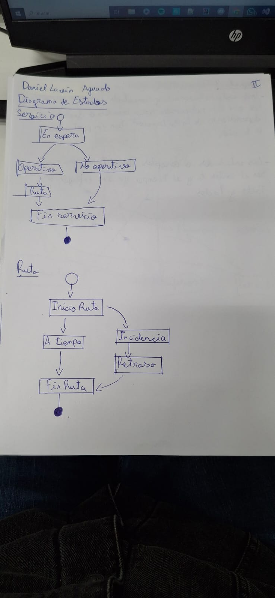
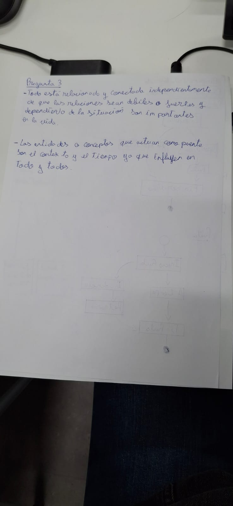
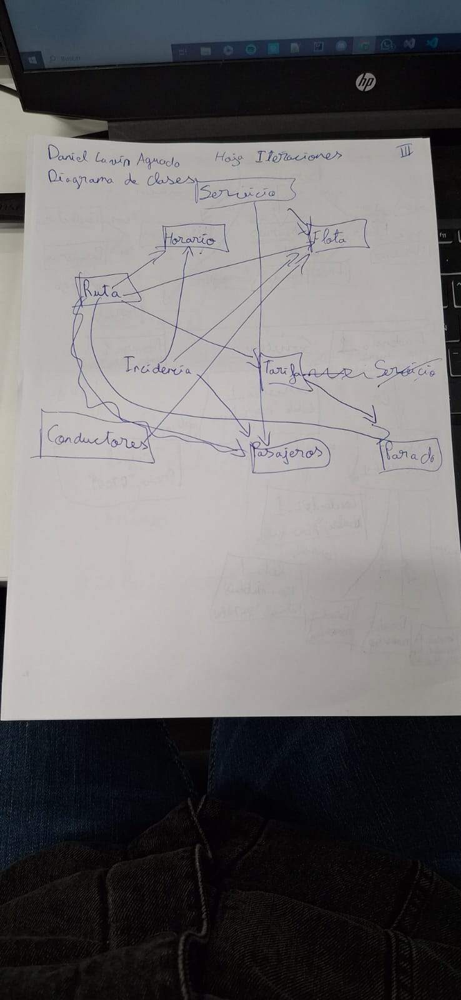
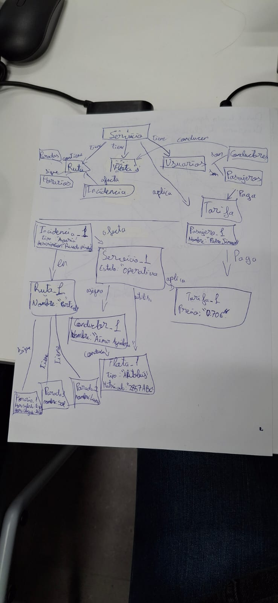
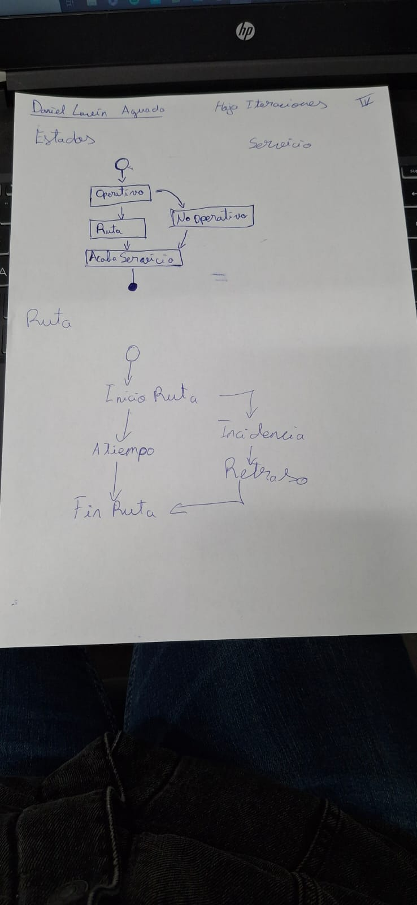

---

# Diagramas con código

Aquí puedes ver los diagramas junto con su código correspondiente:

| Diagrama | Descripción |
|----------|-------------|
| 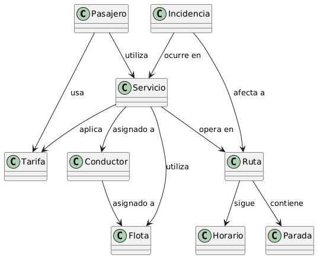 | [Ver código](./modelosUML/diagramaClases.puml) |
| 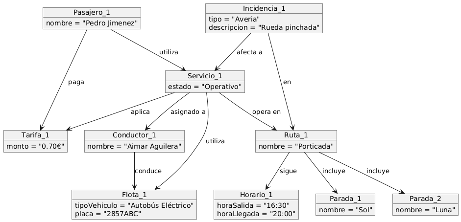 | [Ver código](./modelosUML/diagramaObjetos.puml) |
| 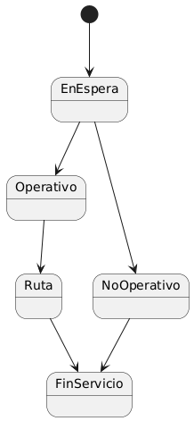 | [Ver código](./modelosUML/diagramaEstados.puml) |
| 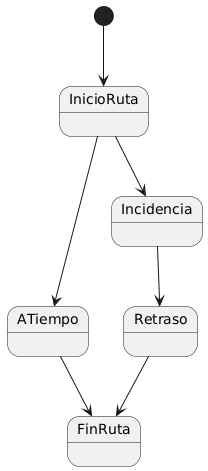 | [Ver código](./modelosUML/diagramaEstados.puml) |

---

# Diagramas Iterados

Aquí puedes ver los diagramas con una iteracion mas junto con su código correspondiente:

| Diagrama | Descripción |
|----------|-------------|
|  | [Ver código](./modelosUML/diagramaClases.puml) |
|  | [Ver código](./modelosUML/diagramaObjetos.puml) |
|  | [Ver código](./modelosUML/diagramaEstados.puml) |
|  | [Ver código](./modelosUML/diagramaEstados.puml) |